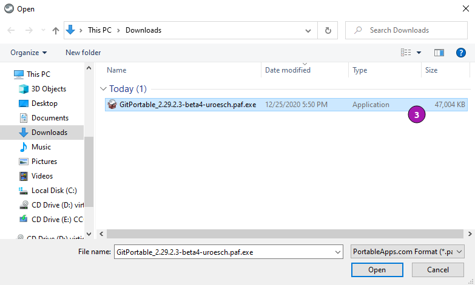
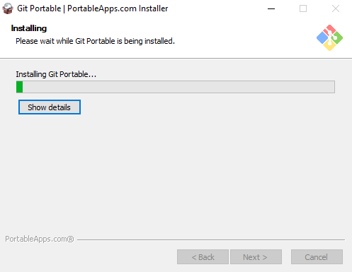
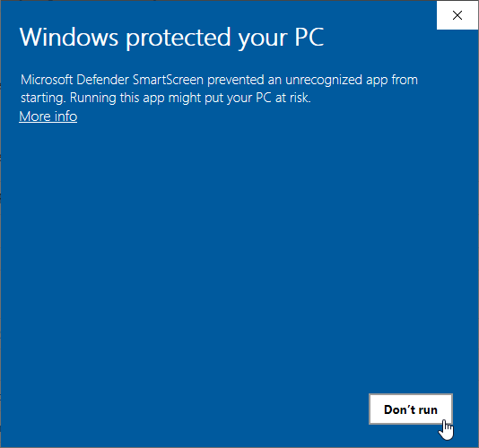

[](https://github.com/uroesch/ApacheDirectoryStudioPortable/actions?query=workflow%3Abuild-package)
[](https://github.com/uroesch/ApacheDirectoryStudioPortable/releases)
[](#runtime-dependencies)
[](#runtime-dependencies)


# Apache Directory Studio Portable for PortableApps.com


[Apache Directory Studio](https://directory.apache.org/studio/) is a complete 
directory tooling platform intended to be used with any LDAP server however 
it is particularly designed for use with ApacheDS. It is an Eclipse RCP 
application, composed of several Eclipse (OSGi) plugins, that can be easily 
upgraded with additional ones. These plugins can even run within Eclipse itself.

Apache Directory Studio is available for Windows, macOS and Linux.

## Runtime dependencies
* 64-bit version of Windows.
* 64-bit version of Java e.g.
  [OpenJDK JRE 64](https://portableapps.com/apps/utilities/OpenJDKJRE64),
  [OpenJDK 64](https://portableapps.com/apps/utilities/OpenJDK64),
  [JRE 64](https://portableapps.com/apps/utilities/java_portable_64) or
  [JDK 64](https://portableapps.com/apps/utilities/jdkportable64) 

## Support matrix

| OS              | 32-bit             | 64-bit              | 
|-----------------|:------------------:|:-------------------:|
| Windows XP      | ![ns][ns]          | ![nd][nd]           | 
| Windows Vista   | ![ns][ns]          | ![ps][ps]           | 
| Windows 7       | ![ns][ns]          | ![ps][ps]           |  
| Windows 8       | ![ns][ns]          | ![ps][ps]           |  
| Windows 10      | ![ns][ns]          | ![fs][fs]           |
| Windows 11      | ![na][na]          | ![ps][fs]           |

Legend: ![ns][ns] not supported; ![na][na] not applicable; ![nd][nd] no data; ![ps][ps] supported but not verified; ![fs][fs] verified;

**Note**: With upstream release 2.0.0.v20200411-M15 the ![32bit Windows build has been dropped][32bit-build].
The last release with 32bit support ist ![2.0.0.v20180908-M14][last-32bit].

## Status 
This PortableApp project is in beta stage. 

## Todo
- [ ] Documentation

<!-- Start include INSTALL.md -->
## Installation

### Download

Since this is not an official PortableApp the PortableApps installer must
be download first. Navigate to https://github.com/uroesch/ApacheDirectoryStudioPortable/releases
for a selection of releases.

### Install via the PortableApps.com Platform

After downloading the `.paf.exe` installer navigate to your PortableApps.com Platform
`Apps` Menu &#10102; and select `Install a new app (paf.exe)` &#10103;.


From the dialog choose the previously downloaded `.paf.exe` file. &#10104;



After a short while the installation dialog will appear.




### Install outside of the PortableApps.com Platform

The Packages found under the release page are not digitally signed so there the installation
is a bit involved.

After downloading the `.paf.exe` installer trying to install may result in a windows defender
warning.



To unblock the installer and install the application follow the annotated screenshot below.


1. Right click on the executable file.
2. Choose `Properties` at the bottom of the menu.
3. Check the unblock box.
<!-- End include INSTALL.md -->

<!-- Start include BUILD.md -->
### Build

#### Windows

##### Windows 10

The only supported build platform for Windows is version 10 other releases
have not been tested.

###### Clone repositories

```
git clone https://github.com/uroesch/PortableApps.comInstaller.git
git clone -b patched https://github.com/uroesch/PortableApps.comLauncher.git
git clone https://github.com/uroesch/ApacheDirectoryStudioPortable.git
```

###### Build installer

```
cd ApacheDirectoryStudioPortable
powershell -ExecutionPolicy ByPass -File Other/Update/Update.ps1
```

#### Linux

##### Docker

Note: This is currently the preferred way of building the PortableApps installer.

For a Docker build run the following command.

###### Clone repo

```
git clone https://github.com/uroesch/ApacheDirectoryStudioPortable.git
```

###### Build installer

```
cd ApacheDirectoryStudioPortable
curl -sJL https://raw.githubusercontent.com/uroesch/PortableApps/master/scripts/docker-build.sh | bash
```

#### Local build

##### Ubuntu 20.04

To build the installer under Ubuntu 20.04 `Wine`, `PowerShell`, `7-Zip` and when building headless
`Xvfb` are required.

###### Setup
```
sudo snap install powershell --classic
sudo apt --yes install git wine p7zip-full xvfb
```

When building headless run the below command starts a virtual Xserver required for the build to
succeed.

```
export DISPLAY=:7777
Xvfb ${DISPLAY} -ac &
```

###### Clone repositories

```
git clone https://github.com/uroesch/PortableApps.comInstaller.git
git clone -b patched https://github.com/uroesch/PortableApps.comLauncher.git
git clone https://github.com/uroesch/ApacheDirectoryStudioPortable.git
```

###### Build installer

```
cd ApacheDirectoryStudioPortable
pwsh Other/Update/Update.ps1
```

##### Ubuntu 18.04

To build the installer under Ubuntu 18.04 `Wine`, `PowerShell`, `7-Zip` and when building headless
`Xvfb` are required.

###### Setup
```
sudo snap install powershell --classic
sudo apt --yes install git p7zip-full xvfb
sudo dpkg --add-architecture i386
sudo apt update
sudo apt --yes install wine32
```

When building headless run the below command starts a virtual Xserver required for the build to
succeed.

```
export DISPLAY=:7777
Xvfb ${DISPLAY} -ac &
```

###### Clone repositories

```
git clone https://github.com/uroesch/PortableApps.comInstaller.git
git clone -b patched https://github.com/uroesch/PortableApps.comLauncher.git
git clone https://github.com/uroesch/ApacheDirectoryStudioPortable.git
```

###### Build installer

```
cd ApacheDirectoryStudioPortable
pwsh Other/Update/Update.ps1
```
<!-- End include BUILD.md -->

[nd]: Other/Icons/no_data.svg
[na]: Other/Icons/not_applicable.svg
[ns]: Other/Icons/no_support.svg
[ps]: Other/Icons/probably_supported.svg
[fs]: Other/Icons/full_support.svg
[32bit-build]: https://github.com/apache/directory-studio/commit/f52d6041fcb3cad0f039903a5c371b1fb8b8d490
[last-32bit]: https://github.com/uroesch/ApacheDirectoryStudioPortable/releases/tag/2.0.0.v20180908-M14-beta3-uroesch
